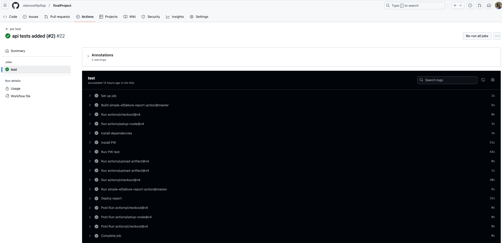
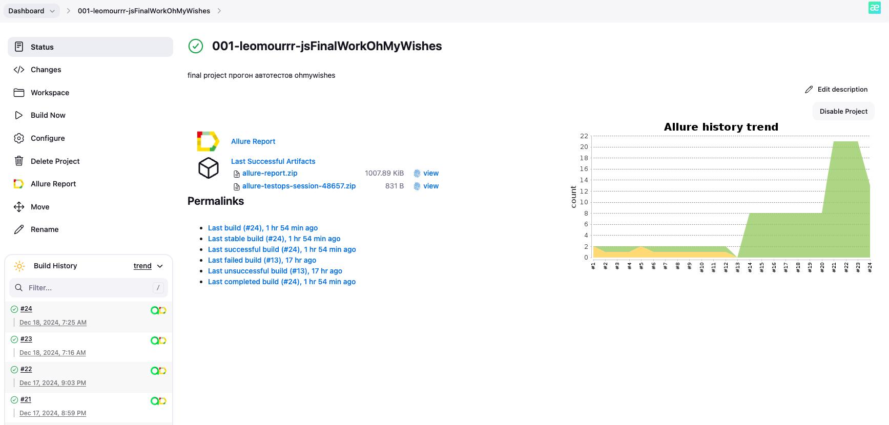
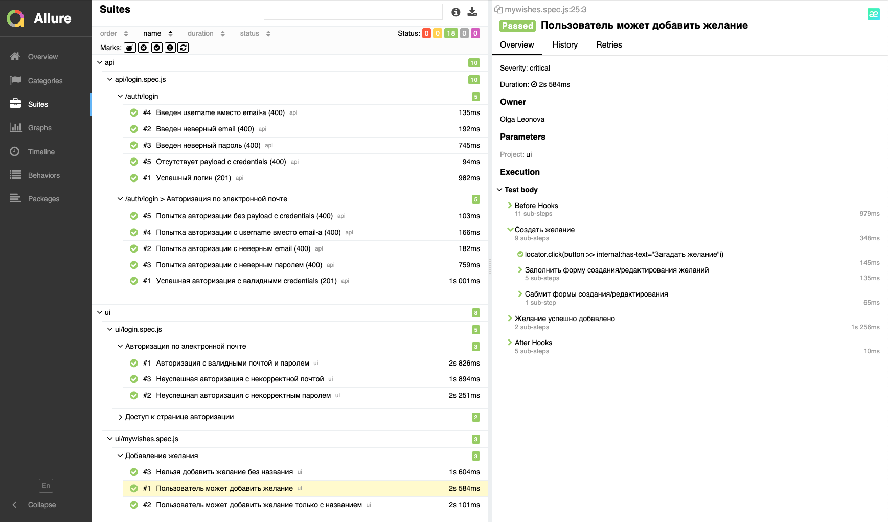
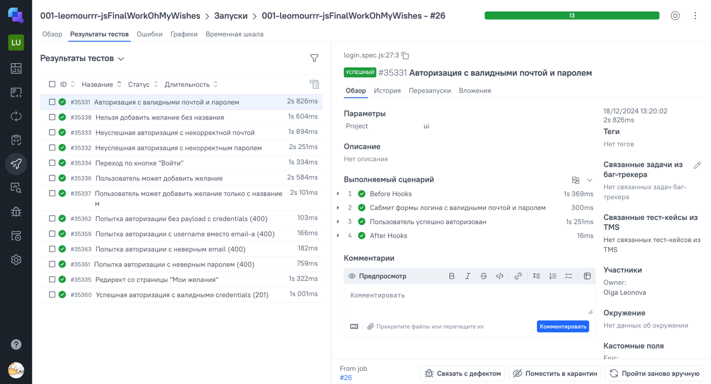
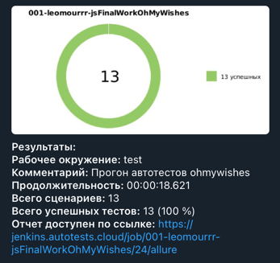

<h1>Проект автоматизации тестирования приложения <a target="_blank" href="https://ohmywishes.ru/"> Ohmywishes </a> </h1>

<p align="center">

</p>

## Содержание
+ [Описание](#описание)
+ [Технологии и инструменты](#технологии-и-инструменты)
+ [Реализованные проверки](#реализованные-проверки)
+ [Запуск тестов](#запуск-тестов)
+ [Пример выполнения теста](#пример-выполнения-теста)
+ [Интеграция с Allure](#интеграция-с-allure)
+ [Интеграция с Allure Testops](#интеграция-с-allure-testops)
+ [Уведомления в Telegram](#уведомления-в-telegram)

## Описание
Ohmywishes — бесплатный сервис вишлистов. Здесь вы можете создавать собственные списки желаний подарков и следить за мечтами друзей.

Проект автоматизации состоит из 2 частей:
- UI-тесты на WEB-приложение
- API-тесты на WEB-приложение 

## Технологии и инструменты
В этом проекте используются следующие технологии и инструменты:
<p align="center">


</p>

Тесты написаны на языке <code>JavaScript</code> с использованием фреймворка для автоматизации тестирования <code>[Playwright](https://playwright.dev)</code>. 
Для написания UI-тестов был использован паттерн Page Object, для API-тестов было использовано разделение api приложения на отдельные сервисы. Для тестовых данных была использована генерация данных с помощью <code>[faker-js](https://fakerjs.dev)</code> и паттерна Builder.

Для организации удалённого запуска тестов предусмотрены интеграции с <code>[Jenkins](https://www.jenkins.io/)</code> и <code>[GitHub Actions](https://docs.github.com/en/actions)</code>. 
После запуска тестов генерируется отчёт Allure и отправляется в <code>[Allure TestOps](https://qameta.io/)</code> для отображения результатов прогона.
Отчет с результатами отправляется ботом в специальный чат <code>Telegram</code>. Для уведомлений в Telegram используется библиотека <code>[allure-notifications](https://github.com/qa-guru/allure-notifications)</code>.

## Реализованные проверки
### UI
<b>Авторизация по электронной почте</b>
> - [x] Авторизация с валидными почтой и паролем
> - [x] Неуспешная авторизация с некорректной почтой
> - [x] Неуспешная авторизация с некорректным паролем

<b>Доступ к странице авторизации</b>
> - [x] Переход по кнопке "Войти"
> - [x] Редирект со страницы "Мои желания"

<b>Добавление желания</b>
> - [x] Нельзя добавить желание без названия
> - [x] Пользователь может добавить желание
> - [x] Пользователь может добавить желание только с названием

### API
<b>Авторизация по электронной почте</b>
> - [x] Успешная авторизация с валидными credentials (201)
> - [x] Попытка авторизации с неверным паролем (400)
> - [x] Попытка авторизации с username вместо email-a (400)
> - [x] Попытка авторизации с неверным email (400)
> - [x] Попытка авторизации без payload c credentials (400)

## Запуск тестов
Автотесты могут быть запущены как локально, так и удаленно.
### Запуск тестов удаленно
Для запуска тестов удаленно настроены два варианта: Github Actions и Jenkins.
- В Github Actions запуск тестов в проекте настроен автоматически на создание merge request-а в ветку main и на обновление ветки main.
Результаты тестов публикуются в виде [Allure отчета в github pages](https://olemoreflipflop.github.io/finalProject/)<br>
Для корректного выполнения тестов, в проекте указаны Secrets с переменными .env
<p align="center">

</p>

- В Jenkins создана отдельная задача с указанными параметрами сборки и настроенным репортингом в Allure Testops и краткими уведомлениями в Telegram.
  Собрать и запустить тесты можно нажатием кнопки «Собрать сейчас»/«Build now».
<p align="center">

</p>

### Запуск тестов локально из терминала
Для запуска тестов локально необходимо скачать проект и добавить в корень проекта .env файл по примеру:

```
BASE_URL = 'https://demourl.com'
USER_EMAIL = 'user@email.com'
USER_PASSWORD = 'userPassword'
```
Далее необходимо установить зависимости:
```
npm install
npx playwright install --with-deps
```
После чего для запуска всех тестов следует использовать команду :
```
npm test
```
Для запуска только API тестов:
```
npm run runApiTests
```
Для запуска только UI тестов:
```
npm run runUiTests 
```

HTML-отчеты Playwright генерируются автоматически после прогона тестов. Для просмотра данного отчета следует использовать команду:
```
 npx playwright show-report
```
Для генерации и просмотра отчета Allure по результатам прогона используйте команду:
```
npm run allure
```

## Пример выполнения теста
<p align="center">

</p>

## Интеграция с Allure
<p align="center">

</p>

## Интеграция с Allure TestOps
<p align="center">

</p>

## Уведомления в Telegram
После завершения сборки в Jenkins, бот, созданный в <code>Telegram</code>, автоматически обрабатывает и отправляет сообщение с отчетом
о прогоне тестов в указанный чат.
<p align="center">

</p>
